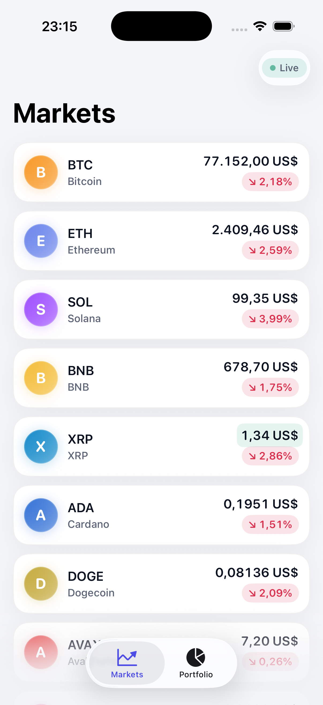
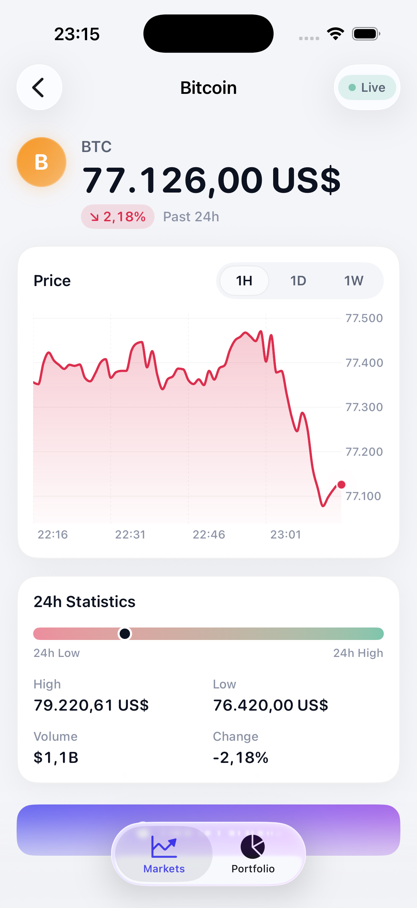
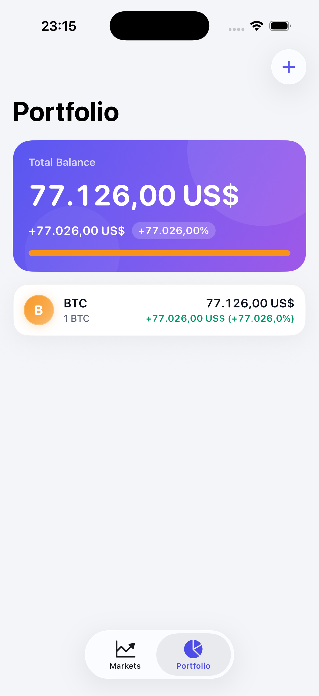
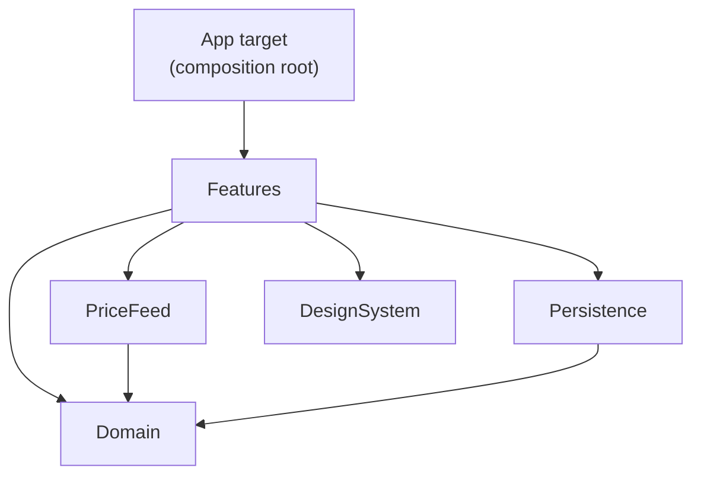

# Pulse — Real-Time Crypto Portfolio Tracker

A portfolio-quality iOS app: live market prices over WebSocket, an animated real-time price chart, and a locally persisted portfolio whose value moves with the market — built entirely with native frameworks (SwiftUI, Swift Charts, Swift Concurrency, URLSession, SwiftPM). No third-party dependencies.

> **Toolchain:** Xcode 16+, iOS 17+, Swift 6 language mode (compiler-enforced data-race safety).

| Markets | Asset Detail | Portfolio |
| :---: | :---: | :---: |
|  |  |  |
| Live prices, sparklines, price flashes | Live-growing chart, scrubbing, timeframes | Live valuation, P&L, allocation |

*(Add screenshots/GIFs from the simulator: the chart growing in real time and a price flash make the best GIF.)*

## What it does

- **Markets** — the tracked assets with live prices streamed from Binance's public WebSocket, 1-hour sparklines, 24h change pills, and green/red flashes on every tick. Skeleton shimmer while loading; friendly error state with retry.
- **Asset detail** — a Swift Charts price chart that *visibly grows* as ticks arrive, with smooth path/domain interpolation, a pulsing "live" dot, drag-to-scrub with a date/price lollipop, and 1H / 1D / 1W timeframes. 24h stats with a low↔high range bar.
- **Portfolio** — add holdings (quantity + optional cost basis); total value, P&L and a brand-colored allocation bar re-price live on every tick. Persisted as JSON, atomically, so it survives restarts. Swipe to delete.
- **Connection status** — a Live / Connecting / Reconnecting badge driven by the feed itself; the socket reconnects with jittered exponential backoff.

## Architecture

One thin app target (the composition root) plus a local SwiftPM package with five modules. Dependencies point strictly inward — the compiler enforces the layering:

| Module | Responsibility |
| --- | --- |
| `Domain` | Pure models and portfolio math (`Decimal` end-to-end). Zero dependencies, trivially testable. |
| `PriceFeed` | Binance WebSocket stream + REST bootstrap (24h stats, klines), reconnection with jittered backoff, defensive decoding, the `LiveMarketFeed` multicast actor, and a mock feed. |
| `Persistence` | `PortfolioStore` actor over a `PortfolioPersisting` protocol; atomic JSON file storage + in-memory test double. |
| `DesignSystem` | Semantic color tokens (light/dark), numeric typography, shimmer skeletons, price-flash modifier, cards, sparklines. |
| `Features` | `@Observable` view models + SwiftUI views for Markets, Detail, and Portfolio. |

**Why SPM modules instead of folders:** folders are a convention; module boundaries are checked on every build. UI code physically cannot import transport internals, and `Domain` cannot accidentally grow a SwiftUI dependency.

## Key technical decisions

### Swift Concurrency over Combine
One-shot calls are `async/await`; the live feed is an `AsyncStream<PriceFeedEvent>`. Chosen over Combine because: (1) consumption is pull-based with an explicit buffering policy — for prices, `.bufferingNewest` is the *correct* backpressure answer (a slow consumer should drop stale ticks, not buffer them); (2) cancellation is structured — when a screen's `for await` loop ends, `onTermination` propagates down and the socket is torn down, with no cancellable bags; (3) the codebase stays in one async paradigm with no bridging seams.

### The stream never throws
`AsyncStream`, not `AsyncThrowingStream` — reconnection is the feed's own job. Consumers see `.tick` and `.status(connecting/live/reconnecting)`; transport errors never cross the module boundary. The UI renders *user-meaningful* states, the transport layer handles transport problems.

### Two actors, each preventing a specific race
- **`LiveMarketFeed`** owns the single upstream socket and multicasts to any number of screens. It protects the subscriber-continuation registry and the latest-price cache — written by the background pump task while the main actor subscribes, unsubscribes and reads. Without isolation that's a torn dictionary write (a real crash). It also collapses N screens → 1 socket, and replays the latest tick to late subscribers so newly opened screens render instantly.
- **`PortfolioStore`** serializes read-modify-write on holdings and keeps file writes in mutation order. Memory is updated first; a failed disk write rolls memory back and rethrows — the UI never shows state that didn't stick.

View models are `@MainActor @Observable`: the compiler proves UI state is only touched on the main thread, and Observation's per-property tracking keeps 1-second ticks from re-rendering more than the views that actually read the changed values.

### Real-time resilience
Reconnection uses **exponential backoff with full jitter** (0.5 s → 30 s cap) — jitter prevents synchronized reconnection stampedes after an outage. The policy is a pure struct with an injected random source, so its exact sequence is unit-tested. Every inbound frame passes one choke point: DTO decode → validation (price parses as `Decimal`, > 0) → domain model. Malformed frames are logged and dropped; one bad message can never crash the stream or paint a bogus number.

### `Decimal` for money
Prices arrive from Binance as JSON *strings* and are parsed directly into `Decimal` with a fixed POSIX locale — `Double` never touches money (binary floating point cannot represent 0.1 and accumulates cent errors in sums). `Double` appears only at the chart/rendering boundary, where geometry is the point.

### Persistence: a file, deliberately
Holdings are a small array of value types — no relationships, no queries, no migrations worth the name. Atomic JSON behind a protocol beats SwiftData here: the module stays dependency-free, the test double is three lines, and I/O timing is explicit. If requirements grew (sync, multi-device, large data), that decision gets revisited — the protocol seam is where SwiftData would slot in.

### The animated chart
The chart is a pure function of an `@Observable` points array; `.animation(.smooth, value: points)` makes Swift Charts geometrically interpolate the path, area fill and y-domain on every appended tick — the line visibly grows rather than redrawing. `interpolationMethod(.monotone)` keeps curves smooth *without* Catmull-Rom overshoot (which would momentarily draw prices that never existed). A `chartOverlay` + `ChartProxy` maps the last data point into plot coordinates for the pulsing live dot, and the same proxy in reverse (`value(atX:)`) drives drag-to-scrub. Live ticks append only on the 1H timeframe and the window self-trims, so the data set stays bounded.

### Design system
Semantic tokens (`Palette.gain`, `.surface`, `.textSecondary` …) with explicit light/dark variants — dark mode is a first-class path, not an afterthought. Numbers use SF Rounded with monospaced digits and `.contentTransition(.numericText())`, so live prices roll like a ticker without layout jitter. Loading states are shimmering skeleton cards shaped like the content they replace.

## Testing strategy

Swift Testing (`@Test` / `#expect`), all doubles injected through the same protocols the app uses:

- **Decoding** — malformed, incomplete, non-numeric, zero and negative payloads are dropped; positional kline decoding.
- **Portfolio math** — `Decimal` exactness, P&L, unpriced holdings, weights, empty portfolio.
- **View models** — loading → loaded/failed → retry transitions; live ticks updating rows and valuations through a hand-controlled stream.
- **Backoff** — ceiling growth, cap, determinism under a seeded generator.
- **Concurrency correctness** — 200 racing mutations against `PortfolioStore` with zero lost updates (fails if the actor becomes a class), and `LiveMarketFeed` multicast/replay semantics.

Run with **⌘U** on an iOS simulator destination.

## Running it

1. Open `CryptoApp.xcodeproj` in Xcode 16+.
2. Select the `CryptoApp` scheme and an iOS 17+ simulator, then **⌘R**.
3. Live data comes from Binance's public endpoints — no API key needed. To demo offline, swap `AppDependencies.live()` for `.mock()` in `CryptoAppApp.swift` (previews already use the mock feed).

If Xcode doesn't resolve the local package on first open: File → Packages → Reset Package Caches.

## Honest production notes

Things simplified deliberately, and what production would add:

- The reconnect *loop* is exercised manually; only its policy (backoff) and parsing are unit-tested. Production: wrap the socket in a `WebSocketConnecting` protocol and test the loop against a scripted transport.
- 24h change on rows comes from the REST snapshot and isn't recomputed from ticks; sparkline seeding fires one klines request per asset. Production: recompute change from the miniTicker `open` field and batch or cache history.
- Tick application is per-frame; at hundreds of symbols I'd coalesce updates (e.g. batch per display refresh) before touching observable state.
- `LiveMarketFeed` keeps its socket for the app's lifetime; with many feeds you'd stop the pump when the last subscriber leaves.
- Error copy is inline English; production would localize via String Catalogs.
